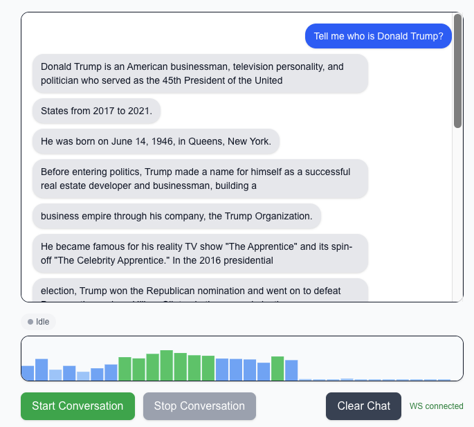

# Cloudflare Full-Stack Voice AI Application

[](https://deploy.workers.cloudflare.com/)
[](https://opensource.org/licenses/MIT)
[](https://www.typescriptlang.org/)
[](https://workers.cloudflare.com/)

A modern, low-latency, real-time voice conversation application built entirely on the Cloudflare ecosystem, featuring seamless AI-powered speech interactions with persistent conversation history.


## Overview

This project implements a cutting-edge voice AI application that enables natural, real-time conversations with AI assistants. Built with a robust **Separation of Concerns** architecture, it leverages Cloudflare's edge computing platform for global performance and reliability.

### Architecture Components

- **Frontend (Static Assets)**: React + Vite application handling UI, audio recording, and playback
- **Backend (API & State)**: Hono on Cloudflare Workers providing lightweight API gateway with session management
- **Real-time State**: Durable Objects managing WebSocket connections and conversation history
- **AI Processing**: Workers AI handling Speech-to-Text, LLM generation, and Text-to-Speech

## Technology Stack

| Component | Technology | Role |
|-----------|------------|------|
| **Frontend** | React, Vite | Modern UI development and static asset bundling |
| **Backend Compute** | Cloudflare Workers | Serverless execution environment for API endpoints |
| **API Framework** | Hono | Extremely lightweight and performant web framework |
| **Real-Time State** | Durable Objects (DO) | Stateful, globally unique instances for session management |
| **AI Services** | Workers AI | Speech-to-Text (STT), LLM generation, and Text-to-Speech (TTS) |
| **Persistence** | DO Storage | Reliable conversation history persistence |

## Key Features

### Real-Time, Low-Latency Voice Pipeline

The application achieves near-instantaneous responses through advanced AI model integration:

- **Speech-to-Text (STT)**: Audio chunks processed by Workers AI Whisper model for accurate transcription
- **Streaming LLM Response**: Real-time text generation with sentence-by-sentence streaming
- **Segmented Audio Return**: Immediate TTS processing and Base64 audio delivery for instant playback

### Advanced Session Management

The `ChatHistoryObject` provides sophisticated conversation handling:

- **Session Singleton**: Unique Durable Object instance per user session
- **WebSocket Management**: Persistent connection lifecycle handling
- **Context Preservation**: Complete conversation history stored in memory and persisted storage
- **Seamless Reconnection**: Automatic history retrieval for uninterrupted conversations

### State Persistence & Retrieval

- **Session ID Tracking**: Browser LocalStorage for persistent user identification
- **Automatic History Retrieval**: Seamless conversation resumption across sessions  
- **Data Management**: User-controlled conversation history clearing

## Quick Start

### Prerequisites

- Node.js 18+ 
- npm or yarn
- Cloudflare account

### Installation

```bash
# Clone the repository
git clone <repository-url>
cd cf-ai-voice-email

# Install dependencies
npm install
```

### Development

```bash
# Start development server (frontend)
npm run dev

# Start development server (backend)
npm run dev:worker

# Run both concurrently
npm run dev:full
```

Your application will be available at:
- Frontend: [http://localhost:5173](http://localhost:5173)
- Backend: [http://localhost:8787](http://localhost:8787)

### Production Deployment

```bash
# Build and deploy to Cloudflare
npm run build
npm run deploy
```

## Project Structure

```
cf-ai-voice-email/
├── src/
│   ├── react-app/           # React frontend application
│   │   ├── components/      # React components
│   │   ├── lib/            # Utility functions
│   │   └── main.tsx        # Application entry point
│   └── worker/             # Cloudflare Workers backend
│       ├── index.ts        # Worker entry point
│       └── chatHistory.do.ts # Durable Object implementation
├── public/                 # Static assets
├── dist/                   # Build output
├── wrangler.toml          # Cloudflare Workers configuration
├── vite.config.ts         # Vite configuration
└── package.json           # Dependencies and scripts
```

## Configuration

### Environment Variables

Create a `.env` file in the root directory:

```env
# Development
VITE_WS_HOST=localhost:8787

# Production (automatically detected)
VITE_WS_HOST=your-worker-domain.workers.dev
```

### Wrangler Configuration

The `wrangler.toml` file contains all necessary configurations for:
- Durable Objects bindings
- AI service integration
- Static asset serving
- Compatibility settings

## API Reference

### WebSocket Endpoints

- `wss://your-domain/chat/{sessionId}` - Main conversation endpoint

### HTTP Endpoints

- `GET /health` - Health check endpoint
- `POST /api/config` - Configuration retrieval

### Message Types

```typescript
// User transcript
{ type: "transcript", text: string }

// AI response with optional audio
{ type: "assistant", text?: string, audio?: string }

// Status updates
{ type: "status", text: string }
```

## Development Guide

### Adding New Features

1. **Frontend Components**: Add React components in `src/react-app/components/`
2. **Backend Logic**: Extend the Durable Object in `src/worker/chatHistory.do.ts`
3. **API Endpoints**: Add routes in `src/worker/index.ts`

### Testing

```bash
# Run type checking
npm run type-check

# Test local deployment
wrangler dev --local

# Monitor production logs
wrangler tail
```

## Performance Optimizations

- **Edge Computing**: Global deployment via Cloudflare's network
- **Streaming Responses**: Real-time AI output processing
- **Connection Persistence**: WebSocket connection reuse
- **Efficient Bundling**: Optimized Vite build configuration